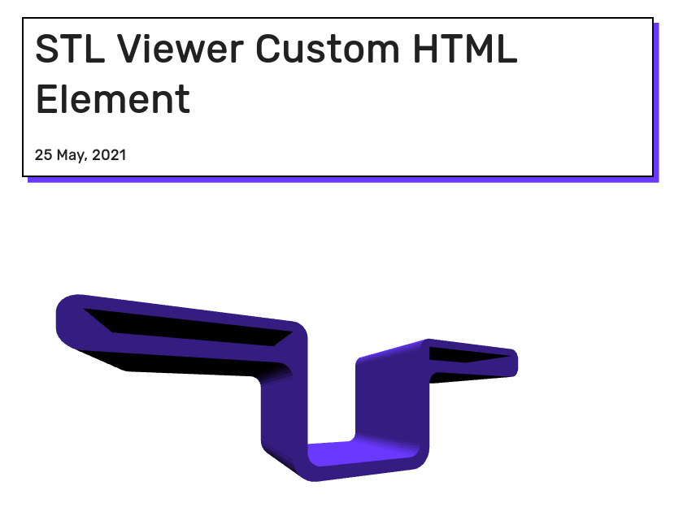

# stl-viewer



An HTML custom element to render 3D STL models in a web page, used on my blog.

Include `stl-viewer` in your web page and then add the custom viewer element:

```html
<html>
  <body>
    <script type="module" src="stl-viewer.js"></script>
    <stl-viewer model="test.stl"></stl-viewer>
  </body>
</html>
```

Pass the path or URI of the STL file in the `model` attribute.
